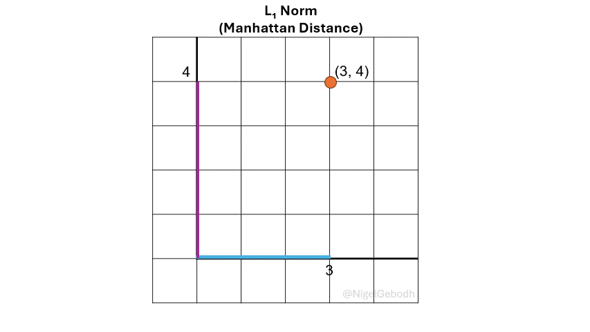
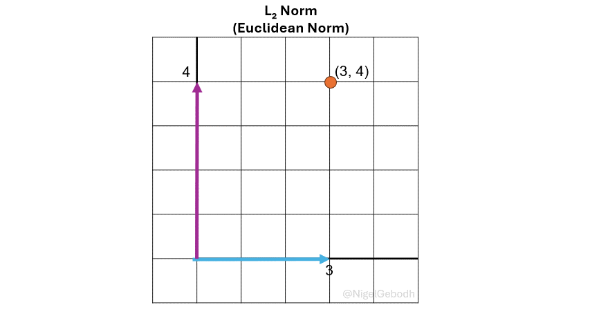
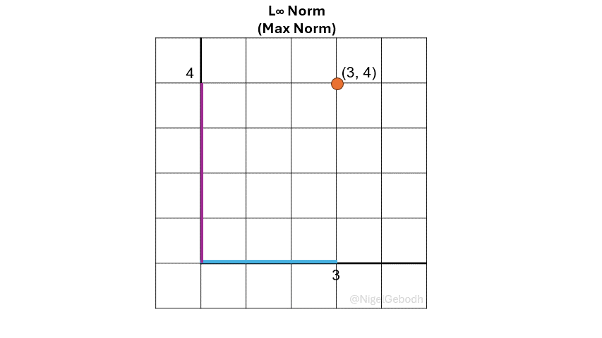

<style>

/\* Whatever that is inside this

```{=html}
<style> tag is all styling for your markup / content structure.
      /* The . with the boxed represents that it is a class */
      .boxed {
        background: #E5FAFA; /* C5F7F8 E5FAFA E1FCFC*/
        color: gray;
        border: 3px solid #2980B9;
        margin: 10% auto;
        width: 95%;
        height: 95%;
        padding: 20px;
        border-radius: 20px;
      }
    </style>
```
<style>

/\* Whatever that is inside this

```{=html}
<style> tag is all styling for your markup / content structure.
      /* The . with the boxed represents that it is a class */
      .boxed_gray {
        background: #eeeeee; /* C5F7F8 E5FAFA E1FCFC a6a6a6*/
        color: gray;
        border: 3px solid #a6a6a6;
        margin: 10% auto;
        width: 95%;
        height: 95%;
        padding: 10px;
        border-radius: 20px;
      }
    </style>
```
<style>

/\* Whatever that is inside this

```{=html}
<style> tag is all styling for your markup / content structure.
      /* The . with the boxed represents that it is a class */
      .boxed_equation {
        background: #f0fff1; /* C5F7F8 E5FAFA E1FCFC a6a6a6  #94DEA5 #c1fba4 #c2f8cb #f0fff1*/
        color: gray;
        border: 3px solid #f0fff1; /* dark blue- #023D54 */
        margin: 10% auto;
        width: 70%;
        height: 95%;
        padding: 10px;
        border-radius: 20px;
      }
    </style>
```
```{python}
#| echo: false
import numpy as np
from IPython.display import display, Math

def print_result(type_in=1, val=None):
    if type_in =="MAE":
        str_in =f"MAE: {val}"
    elif type_in == "MSE":
        str_in =f"MSE: {val}"
    else:
        str_in ="L_{{{}}}-norm: {}".format(type_in, val)
    return display(Math(str_in))

```


<figcaption>Image by DALL-E 3</figcaption>

# What exactly is a norm?

Norms are a fundamental concept in linear algebra and machine learning. Here we'll look at some common norms used in machine learning and how they're applied.

::: boxed
***Norms*** are a class of mathematical operations used to quantify or measure the length or size of vector or matrix or distance between vectors or matrices. </mark>

-   Since norms measure lengths, distances, or magnitudes they are typically ≥ 0.

-   This is useful in machine learning in cases where you want to build models where you minimize error between predictions and ground truth.
:::

# **How are norms applied in machine learning?**

::: boxed_gray
In machine learning norms are applied in:

-   **Distance metrics**:
    -   Since norms measure lengths, distances, magnitudes they can be applied to measure the length of a vector or distances between vectors ($d(u, v)$). They are used in various algorithms that rely on datapoint distance calculations like [k-Nearest Neighbor](https://en.wikipedia.org/wiki/K-nearest_neighbors_algorithm) or [k-Means Clustering](https://en.wikipedia.org/wiki/K-means_clustering).
-   **Loss functions**:
    -   Since norms help in calculating distances and are widely adapted in error or loss calculations like the Mean Squared Error (MSE) and Mean Absolute Error (MAE).
-   **Regularization**:
    -   Techniques like LASSO and Ridge regularization/regression apply the $L_1$ and $L_2$ norms to prevent model overfitting by inducing sparsity and reducing model weights.
-   **Feature selection**:
    -   Norms like the $L_1$ can help with feature selection by zeroing out unimportant features or creating a sparse solution (some elements in the solution are zero). [Check out Dr. Steve Brunton’s explanation](https://www.youtube.com/watch?v=76B5cMEZA4Y).
:::

# Common Norms in Machine Learning

-   ***L₁*** **Norm** (Manhattan Norm or Taxicab norm)

-   ***L₂*** **Norm** (Euclidean Norm or Magnitude)

-   **𝐿∞ Norm** (Max Norm or Chebyshev Norm)

-   ***Lₚ*** **(*0****≤**p\<1*****) “Norm” (**Not very common, but can show up)

## Norm Notation

Norms are typically denoted with double vertical lines around a transformation being applied (here a $\cdot$ is used as a space holder) and the norm type as a subscript on the outside ($p$, where $p$ can be $p \geq 0, 1, 2, 3, ...,\infty$). If $p$ is not explicitly given, the norm is assumed to be $p=2$ since it is the most commonly used norm. Norms can also be denoted with either a capital letter $L$ or a lower case $\ell$ with the letter 𝑝 as either a superscript ($L^p$) or subscript ($L_p$) .\
$$
L_p = \ell_p = \Vert \cdot \Vert_p
$$

Typical transformations can be:

-   Absolute value  —   $|\mathbf{x}|$
-   Squaring  —   $|\mathbf{x}|^2$
-   Min/Max operations  —   $min(|\mathbf{x}|)$ or $max(|\mathbf{x}|)$

## $L_1$ Norm (Manhattan Norm)

The $L_1$ norm or $\ell_1$, also known as Manhattan norm or Taxicab norm, is defined as the sum of the absolute values of the vector components. It's referred to as the Manhattan norm because distance is calculated in a gridwise format similar to the gridded blocks in Manhattan.

::: boxed_equation
$$
\textcolor{teal}{L_1 := ||\mathbf{x}||_{p=1} := \sum_{i=1}^n  |x_i|}
$$
:::

$$
or
$$ $$
\begin{align*}
||\mathbf{x}||_{p=1} & :=  \left[ \sum_{i=1}^n  |x_i|^1 \right]^\frac{1}{1}
\end{align*}
$$

$$
or
$$

$$
||\mathbf{x}||_{p=1} := |x_1|^1 + |x_2|^1 + |x_3|^1 + ... + |x_N|^1
$$

$$
or
$$

$$
||\mathbf{x}||_{p=1} := |x_1| + |x_2| + |x_3| + ... + |x_N|
$$

$\textcolor{darkorange}{Note}$: A number to the power of 1 is just that number returned (i.e. $3^1 = 3$, $x^1 = x$). Here the powers are added for demonstration and later generalization.




### $\cdot$ Example: $L_1$ Norm

<details>

<summary>Example</summary>

#### **1.** $L_1$ Example

Given a vector $\mathbf{x} = [3,4]$, compute the $\ell_\textcolor{red}1$ norm.

$$
||\mathbf{x}||_{1} := \sum_{i=1}^n  |x_i| := \left[ \sum_{i=1}^n  |x_i|^\textcolor{red}1 \right]^\frac{1}{\textcolor{red}1}
$$ $$
\begin{align*}
||\mathbf{x}||_{1} & = \left[ \sum_{i=1}^{n=2}  |x_i|^\textcolor{red}1 \right]^\frac{1}{\textcolor{red}1} \\
& = (|3|^\textcolor{red}1 + |4|^\textcolor{red}1)^\frac{1}{\textcolor{red}1}\\
& = ( 3 + 4)^\frac{1}{\textcolor{red}1}\\
& = ( 7)^1 \\
& = 7
\end{align*}
$$

$$
or 
$$ $$
||\mathbf{x}||_{1} = |3| + |4| =  3 + 4 = 7
$$

```{python}
import numpy as np
from numpy.linalg import norm

norm_type = 1
x = np.array([3,4])

norm_l1 = np.sum(np.abs(x))
print_result(type_in=norm_type, val=norm_l1)
# norm_l1 : 7

norm_l1 = norm(x, 1)
print_result(type_in=norm_type, val=norm_l1)
# norm_l1 : 7

```

#### **2. Distance Example**

Given two vectors compute their Manhattan distance.<br> $\mathbf{u} = [1, 2, 3]$ $\mathbf{v} = [4, 5, 6]$

Steps:

-   Compute the error
-   Find the absolute value
-   Sum all elements

$$
\begin{align*}
||\mathbf{x}||_{1} & = |1-4| + |2-5| + |3-6| \\
 & = |-3| + |-3| + |-3| \\
 & = 3 + 3 + 3 \\
 & = 9\\
\end{align*}
$$

```{python}
import numpy as np
from numpy.linalg import norm
u = [1, 2, 3]
v = [4, 5, 6]

norm_type = 1
x = np.subtract(u,v)

norm_l1 = np.sum(np.abs(x))
print_result(type_in=norm_type, val=norm_l1)
# norm_l1 : 9

norm_l1 = norm(x, 1)
print_result(type_in=norm_type, val=norm_l1)
# norm_l1 : 9

```

</details>

## $L_2$ Norm (Euclidean Norm)

The $L_2$ norm or $\ell_2$, also known as the Euclidean norm is defined as the square root of the sum of squared vector components.

::: boxed_equation
$$
\textcolor{teal}{L_2 := ||\mathbf{x}||_{p=2} := \sqrt[2]{\sum_{i=1}^n  |x_i|^2 }  }
$$
:::

$$
or
$$

$$
||\mathbf{x}||_{p=2} :=  \left[ \sum_{i=1}^n  |x_i|^2 \right]^\frac{1}{2}
$$

$$
or
$$

$$
||\mathbf{x}||_{p=2} := (|x_1|^2 + |x_2|^2 + |x_3|^2 + ... + |x_N|^2)^\frac{1}{2}
$$

$\textcolor{darkorange}{Note}$: Values raised to the power of a fraction are equivalent to the $n^{th}$ root (i.e. $x^\frac{1}{n} = \sqrt[n]{x}$ or $25^\frac{1}{2} = \sqrt[2]{25} = 5$). Here the powers are added for demonstration and later generalization.




### $\cdot$ Example: $L_2$ Norm

<details>

<summary>Example</summary>

#### **1.** $L_2$ Example

Given a vector $\mathbf{x} = [3,4]$, compute the $\ell_\textcolor{red}2$ norm

$$
||\mathbf{x}||_{p=\textcolor{red}2} = \sqrt[\textcolor{red}2]{\sum_{i=1}^n  |x_i|^\textcolor{red}2 } : =  \left[ \sum_{i=1}^n  |x_i|^\textcolor{red}2 \right]^\frac{1}{\textcolor{red}2}
$$ $$
\begin{align*}
||\mathbf{x}||_{\textcolor{red}{2}} & = \sqrt[\textcolor{red}{2}]{ |3|^\textcolor{red}{2} + |4|^\textcolor{red}{2} }\\
& = \sqrt[\textcolor{red}{2}]{ 9 + 16 }\\
& = \sqrt[\textcolor{red}{2}]{25} \\
& = 5
\end{align*}
$$

```{python}
import numpy as np
from numpy.linalg import norm

norm_type = 2
x = np.array([3,4])

norm_l2 = np.sqrt(np.sum(x**2))
print_result(type_in=norm_type, val=norm_l2)
# norm_l2 : 5

norm_l2 = norm(x, 2)
print_result(type_in=norm_type, val=norm_l2)
# norm_l2 : 5 

```

#### **2. Distance Example**

Given two vectors compute their Euclidian distance.<br> $\mathbf{u} = [1, 2, 3]$ $\mathbf{v} = [4, 5, 6]$

Steps:

-   Compute the error
-   Find the absolute value, squared
-   Sum all elements
-   Compute the square root

$$
\begin{align*}
||\mathbf{x}||_{\textcolor{red}{2}} & = (|1-4|^\textcolor{red}{2} + |2-5|^\textcolor{red}{2} + |3-6|^\textcolor{red}{2})^{\frac{1}{\textcolor{red}{2}}} \\
 & = (|-3|^\textcolor{red}{2} + |-3|^\textcolor{red}{2} + |-3|^\textcolor{red}{2})^{\frac{1}{\textcolor{red}{2}}} \\
 & = (9 + 9 + 9)^{\frac{1}{\textcolor{red}{2}}} \\
 & = (27)^{\frac{1}{\textcolor{red}{2}}}\\
 & = 5.196\\
\end{align*}
$$

```{python}
import numpy as np
from numpy.linalg import norm
u = [1, 2, 3]
v = [4, 5, 6]

norm_type = 2
x = np.subtract(u,v)

norm_l2 = np.sqrt(np.sum(x**2))
print_result(type_in=norm_type, val=norm_l2)
# norm_l2 : 5.196

norm_l2 = norm(x, 2)
print_result(type_in=norm_type, val=norm_l2)
# norm_l2 : 5.196

```

</details>

## $L_\infty$ Norm (Max Norm)

The $L_\infty$ norm or $\ell_\infty$, also known as the Max norm is defined as the maximum value of a vector. It is sometimes referred to as [Chebyshev distance](https://en.wikipedia.org/wiki/Chebyshev_distance) or Chebyshev norm. It is useful when the largest deviation is of interest like in outlier or anomaly detection.

::: boxed_equation
$$
\textcolor{teal}{ \\
||\mathbf{x}||_{p=\infty} := {max_{1 \leq i \leq N}} |x_i| \\
}
$$
:::




### $\cdot$Example: $L_\infty$ Norm

<details>

<summary>Example</summary>

#### **1.** $L_\infty$ Example

Given a vector $\mathbf{x} = [3,4]$, compute the $\ell_\infty$ norm

$$
||\mathbf{x}||_{p=\infty} = {max_{1 \leq i \leq N}} |x_i|
$$ $$
||\mathbf{x}||_{\infty} := max [|3|, |4|] := 4
$$

```{python}
import numpy as np
from numpy.linalg import norm

norm_type = '\infty'
x = np.array([3,4])

norm_linf = np.max(np.abs(x))
print_result(type_in=norm_type, val=norm_linf)
# norm_linf : 4

norm_linf = norm(x, np.inf)
print_result(type_in=norm_type, val=norm_linf)
# norm_linf : 4

```

#### **2. Distance Example**

Given two vectors compute their $L_\infty$ distance.<br> $\mathbf{u} = [1, 2, 3]$ $\mathbf{v} = [4, 5, 6]$

Steps:

-   Compute the error
-   Find the absolute value
-   Find the maximum value of all elements

$$
\begin{align*}
||\mathbf{x}||_{1} & = max [|1-4| , |2-5| , |3-6|] \\
 & = max [|-3| , |-3| , |-3|] \\
 & = max [3 , 3 , 3] \\
 & = 3
\end{align*}
$$

```{python}
import numpy as np
from numpy.linalg import norm
u = [1, 2, 3]
v = [4, 5, 6]

norm_type = '\infty'
x = np.subtract(u,v)

norm_linf = np.max(np.abs(x))
print_result(type_in=norm_type, val=norm_linf)
# norm_linf : 3

norm_linf = norm(x, np.inf)
print_result(type_in=norm_type, val=norm_linf)
# norm_linf : 3

```

</details>

## $L_p$ Norm (Generalized Norm)

Norms can be generalized to the $L_p$ or $\ell_p$ form. This generalized form allows for the computation of any $p$ norms.

::: boxed_equation
$$
\textcolor{teal}{ \\
L_p := ||\mathbf{x}||_{p} := \sqrt[p]{\sum_{i=1}^n  |x_i|^p} := \left[ \sum_{i=1}^n  |x_i|^p   \right]^\frac{1}{p} \\
}
$$
:::

::: boxed_gray
Norms follow a set of rules:

-   **Non-Negativity**: Norms are non-negative values. It makes sense since they are computed to get the length or size of a vector or matrix. $$
    ||\mathbf{u}||_{p} \geq 0
    $$

-   **Definiteness**: Norms are only 0 if the vector being measured is a zero vector (it has a length of 0).

$$
||\mathbf{u}||_{p} = 0   \quad only \quad if \quad \mathbf{u} = 0 
$$

-   **Triangle inequality**: The norm of the sum of two vectors $\mathbf{u}$ and $\mathbf{v}$ (\|\|𝐮+𝐯\|\|) is not more than the sum of their norms (\|\|𝐮\|\| + \|\|𝐯\|\|). This is similar to the *Pythagorean Theorem* where $||\mathbf{u}||$ and $||\mathbf{v}||$ are the sides of a triangle and $||\mathbf{u} + \mathbf{v} ||$ is the hypotenuse of the triangle. It is sometimes referred to as [Minkowski’s Inequality](https://en.wikipedia.org/wiki/Triangle_inequality). Mathematically this is: $$
    ||\mathbf{u} + \mathbf{v} ||_p \leq ||\mathbf{u} ||_p + ||\mathbf{v}||_p
    $$

-   **Homogeneity**: If you multiply a vector $\mathbf{u}$ by a scalar $k$ and compute the norm its equivalent to multiplying the norm of the vector $\mathbf{u}$ by the absolute value of that scalar $k$:

$$
||k\mathbf{u} || = |k| ||\mathbf{u} || 
$$
:::

### $\cdot$ Example: $L_p$ Norms

<details>

<summary>Example</summary>

#### **1.** $L_3$ Norm

Given a vector $\mathbf{x} = [3,4]$, compute the $\ell_\textcolor{red}3$ norm $$
||\mathbf{x}||_{p=\textcolor{red}3} = \left[ \sum_{i=1}^n  |x_i|^\textcolor{red}3 \right]^\frac{1}{\textcolor{red}3}  :=  \sqrt[\textcolor{red}3]{\sum_{i=1}^n  |x_i|^\textcolor{red}3}
$$ $$
\begin{align*}
||\mathbf{x}||_{3} & = \sqrt[3]{ |3|^3 + |4|^3 } \\
& = \sqrt[3]{ 27 + 64 }\\ 
& = \sqrt[3]{91}\\ 
& = {91}^\frac{1}{3}\\ 
& = 4.498
\end{align*}
$$

```{python}
import numpy as np

x = np.array([3,4])

p=3

norm_p = np.sum(np.abs(x)**p)**(1/p)
print_result(type_in=p, val=norm_p )

```

#### **2.** $L_4$ Norm

Given a vector $\mathbf{x} = [3,4]$, compute the $\ell_\textcolor{red}4$ norm $$
||\mathbf{x}||_{p=\textcolor{red}4} = \left[ \sum_{i=1}^n  |x_i|^\textcolor{red}4 \right]^\frac{1}{\textcolor{red}4}  :=  \sqrt[\textcolor{red}4]{\sum_{i=1}^n  |x_i|^\textcolor{red}4}
$$ $$
\begin{align*}
||\mathbf{x}||_{4} & = \sqrt[4]{ |3|^4 + |4|^4 }\\
& = \sqrt[4]{ 81 + 256 }\\
& = \sqrt[4]{337}\\
& = {337}^\frac{1}{4}\\
& =  4.285
\end{align*}
$$

```{python}
import numpy as np

x = np.array([3,4])

p=4

norm_p = np.sum(np.abs(x)**p)**(1/p)
print_result(type_in=p, val=norm_p )

```

</details>

## Other $L_p$ "Norms"

**What happens to norms when *0 ≤ p\<1*?** \
Well, we get a calculated length back, however these cases are not strictly norms (hence “norms”) since we get a violation of the triangle inequality (*0\<p\<1*) or homogeneity (*p=0*).

### $L_p$ for $0<p<1$ Norm

What happens when $p$ is between $0$ and $1$ ($0<p<1$)?

In this case ($0<p<1$) the triangle inequality is violated. The means that, strictly speaking, $L_{0<p<1}$ is not actually a norm but it still returns a measurement of size of a vector. The same generalized formula can be used:

::: boxed_equation
$$
\textcolor{teal}{ \\
L_{0 \lt p \lt 1} := ||\mathbf{x}||_{0 \lt p \lt 1} := \sqrt[p]{\sum_{i=1}^n  |x_i|^p} := \left[ \sum_{i=1}^n  |x_i|^p   \right]^\frac{1}{p} \\
}
$$
:::

<details>

<summary>Example</summary>

#### **1.** $L_{0.5}$ Example

Given a vector $\mathbf{x} = [3,4]$, compute the $\ell_{\textcolor{red}{0.5}}$ norm $$
||\mathbf{x}||_{p={\textcolor{red}{0.5}}} = \left[ \sum_{i=1}^n  |x_i|^{\textcolor{red}{0.5}}\right]^\frac{1}{\textcolor{red}{0.5}}  :=  \sqrt[\textcolor{red}{0.5}]{\sum_{i=1}^n  |x_i|^\textcolor{red}{0.5}}
$$

$$
Simplifying:
$$

$$
\begin{align*}
||\mathbf{x}||_{p={\textcolor{red}{0.5}}} & = \left[ \sum_{i=1}^n  |x_i|^{\textcolor{red}{0.5}}\right]^\frac{1}{\textcolor{red}{0.5}}  \\
||\mathbf{x}||_{p={\textcolor{red}{0.5}}} & = \left[ \sum_{i=1}^n  |x_i|^\textcolor{red}{\frac{1}{2}}\right]^\frac{1}{\textcolor{red}{\frac{1}{2}}}\\
||\mathbf{x}||_{p={\textcolor{red}{0.5}}} & = \left[ \sum_{i=1}^n  |x_i|^\textcolor{red}{\frac{1}{2}}\right]^{\textcolor{red}{2}}\\
||\mathbf{x}||_{p={\textcolor{red}{0.5}}} & =
        (|x_1|^{\textcolor{red}{\frac{1}{2}}} +
         |x_2|^{\textcolor{red}{\frac{1}{2}}} +
         |x_3|^{\textcolor{red}{\frac{1}{2}}} + ... +
         |x_N|^{\textcolor{red}{\frac{1}{2}}}
         )^{\textcolor{red}{2}}\\
||\mathbf{x}||_{p={\textcolor{red}{0.5}}} & =  (\sqrt[\textcolor{red}{2}]{|x_1|} + \sqrt[\textcolor{red}{2}]{|x_2|} + \sqrt[\textcolor{red}{2}]{|x_3|} + ... + \sqrt[\textcolor{red}{2}]{|x_N|})^{\textcolor{red}{2}}\\
\end{align*}
$$

$$
\begin{align*}
||\mathbf{x}||_{0.5} & = ( \sqrt[2]{|3|} + \sqrt[2]{|4|} )^2 \\
                     & = (1.73 + 2)^2  \\
                     & = (3.73)^2 \\
                     & =  13.93 \\
\end{align*}
$$

```{python}
import numpy as np

x = np.array([3,4])

p=0.5

norm_p = np.sum(np.abs(x)**p)**(1/p)
print_result(type_in=p, val=norm_p )

```

#### **2. Distance Example**

Given two vectors compute their $L_{0.5}$ distance.<br> $\mathbf{u} = [1, 2, 3]$ $\mathbf{v} = [4, 5, 6]$

Steps:

-   Compute the error
-   Find the absolute value
-   Compute the square root of all elements
-   Sum all elements and square the result

$$
\begin{align*}
||\mathbf{x}||_{0.5} & = (\sqrt[2]{|1-4|} + \sqrt[2]{|2-5|} + \sqrt[2]{|3-6|})^2 \\
 & = (\sqrt[2]{|-3|} + \sqrt[2]{|-3|} + \sqrt[2]{|-3|})^2\\
 & = (\sqrt[2]{3} + \sqrt[2]{3} + \sqrt[2]{3})^2 \\
 & = (1.732 + 1.732 + 1.732)^2 \\
 & = (5.196)^2 \\
 & = 27\\
\end{align*}
$$

```{python}
import numpy as np

u = [1, 2, 3]
v = [4, 5, 6]

x = np.subtract(u,v)

p=0.5

norm_p = np.sum(np.abs(x)**p)**(1/p)
print_result(type_in=p, val=norm_p )

```

#### **3.** $L_{0.5}$ Violates Triangle Inequality Example

Given two vectors show that $L_{0.5}$ norm violates the triangle inequality. <br> $\mathbf{u} = [1, 2, 3]$ $\mathbf{v} = [4, 5, 6]$

Remember that the triangle inequality states: \* The $p$ norm of the sum of two vectors is less than or equal to the sum of the $p$ of each vector

$$
||\mathbf{u} + \mathbf{v} ||_p \leq ||\mathbf{u} ||_p + ||\mathbf{v}||_p
$$

Steps:

-   Compute the sum of $\mathbf{u}$ and $\mathbf{v}$
-   Find the $p$ norm of the sum
-   Compute the $p$ norm of $\mathbf{u}$ then $\mathbf{v}$
-   Sum the individual norms
-   Compare both sides of the inequality

$$
\begin{align*}
        ||\mathbf{u} + \mathbf{v} ||_p     & \leq ||\mathbf{u} ||_p + ||\mathbf{v}||_p\\
        ||\mathbf{u} + \mathbf{v} ||_{0.5} & \leq ||\mathbf{u} ||_{0.5} + ||\mathbf{v}||_{0.5}\\
\quad\\        
        (\sqrt[2]{|1+4|} + \sqrt[2]{|2+5|} + \sqrt[2]{|3+6|})^2 & \leq 
             (\sqrt[2]{|1|} + \sqrt[2]{|2|} + \sqrt[2]{|3|})^2 +
             (\sqrt[2]{|4|} + \sqrt[2]{|5|} + \sqrt[2]{|6|})^2\\
\quad\\
        (\sqrt[2]{|5|} + \sqrt[2]{|7|} + \sqrt[2]{|9|})^2 & \leq 
            (\sqrt[2]{|1|} + \sqrt[2]{|2|} + \sqrt[2]{|3|})^2 +
            (\sqrt[2]{|4|} + \sqrt[2]{|5|} + \sqrt[2]{|6|})^2\\     
\quad\\
        (2.236 + 2.646 + 3)^2 & \leq 
            (1 + 1.414 + 1.732)^2 +
            (2 + 2.236 + 2.449)^2\\ 
\quad\\
        ( 7.882)^2 & \leq 
            (4.146)^2 +
            (6.686)^2\\ 
\quad\\
        62.123 & \leq 
            17.192 +
            44.697\\ 
\quad\\
        62.123 & \leq 61.888  (\textcolor{red}{Violation!})   \\     
\end{align*}
$$

```{python}
import numpy as np

u = [1, 2, 3]
v = [4, 5, 6]

x = np.add(u,v)

p=0.5

norm_p_uv = np.sum(np.abs(x)**p)**(1/p)
print_result(type_in='||u+v||_{0.5}', val=norm_p_uv )


x = u
p=0.5
norm_p_u = np.sum(np.abs(x)**p)**(1/p)
print_result(type_in='||u||_{0.5}', val=norm_p_u  )

x = v
p=0.5
norm_p_v = np.sum(np.abs(x)**p)**(1/p)
print_result(type_in='||v||_{0.5}', val=norm_p_v )

norm_p_v_u = norm_p_u + norm_p_v
print_result(type_in='||u||_{0.5} + ||v||_{0.5}', val=norm_p_v_u)

```

</details>

### $L_0$ "Norm"

The $L_0$ "norm" is not actually a norm but sometimes mentioned in the context of norms. It violates the homogeneity rule above. When applied, the $L_0$ "norm" counts the number of non-zero elements in a vector. This operation can be used to apply regularization, signal compression etc.

::: boxed_equation
$$
\textcolor{teal}{ \\
L_0 := ||\mathbf{x}||_{p=0} := Count(x_i \neq 0)  
}
$$
:::

$$
or
$$

$$
||\mathbf{x}||_{p=0} :=  \sum_{i=1}^n  I(x_i \neq 0)    \\
$$

$$
Where: \\
\quad \\
I(\cdot)=
\left\{ 
  \begin{array}{ c l }
    1 & \quad \textrm{if } x_i \neq 0 \\
    0                 & \quad \textrm{otherwise}
  \end{array}
\right.
$$

<details>

<summary>Example</summary>

Given a vector $\mathbf{x} = [3,4,0]$ compute the $\ell_0$ "norm"

$$
\begin{align*}
||\mathbf{x}||_{p=0} & := Count(x_i \neq 0) \\ 
||\mathbf{x}||_{p=0} & :=  \sum_{i=1}^n  I(x_i \neq 0)  \\
\quad
||\mathbf{x}||_{p=0} & =  I(3 \neq 0) +I(4 \neq 0) + I(0 \neq 0)  \\
||\mathbf{x}||_{p=0} & =  1 + 1 + 0  = 2\\
\end{align*}
$$

This means there are $2$ non-zero elements in the vector $\mathbf{x}$

```{python}
import numpy as np

x = np.array([3,4,0])
l0_norm = np.sum(x != 0)
print_result(type_in=0, val=l0_norm)

```

</details>

# Norms and Loss Functions

**Loss functions** are functions developed to help **minimize the error between actual and predicted outcomes**. Both the commonly used $L_1$ and $L_2$ norms are connected to some widely used loss functions or cost functions. Namely the computation of the Mean Absolute Error (MAE) and Mean Squared Error (MSE).

When norms are adapted as loss functions, one aspect that is important is that they are **convex**. This aids in convex optimization techniques like gradient descent. It allows these functions to converge to a global minimum. This means that:

-   *Typically*, norms adapted for loss functions are $L_{p \geq 1}$ and are convex for all $p \geq 1$.
-   Norms where $0 \lt p \lt 1$ can be non-convex, making it unsuitable for convex optimization.

<details>

<summary>Comparing Convexity between $L_{0.5}$, $L_1$, and $L_2$</summary>

To compare the convexity between transformations within the $L_{0.5}$, $L_1$, and $L_2$ norms, we can compute the derivatives of the functions used within each norm.

It's important to note that all norms for $p \geq 1$ are convex.

| Norm        | Function          | First Derivative                                            | Second Derivative                        | Convex/Non-Convex |
|-------------|-------------------|-------------------------------------------------------------|------------------------------------------|-------------------|
| $L_{p=1}$   | $|x|$             | $1$ for $x \gt 0$, $-1$ for $x \lt 0$, undefined at $x = 0$ | $0$ for $x \neq 0$, undefined at $x = 0$ | Convex            |
| $L_{p=2}$   | $x^2$             | $2x$                                                        | $2$                                      | Convex            |
| $L_{p=0.5}$ | $x^{\frac{1}{2}}$ | $\frac{1}{2}x^{\frac{-1}{2}}$                               | $\frac{-1}{4}x^{\frac{-3}{2}}$           | Non-Convex        |

What we see is:

-   The derivative of $|x|$ is not defined at $x = 0$, and its second derivative is $0$ for all $x \neq 0$. Regardless of this the function satisfies the triangle inequality and is considered **convex**.
-   The second derivative of $x^2$ is always $2$, which is non-negative, so $x^2$ is **convex**.
-   The second derivative of $x^{\frac{1}{2}}$ is negative for all $x \geq 0$, so $x^{\frac{1}{2}}$ is **non-convex**.

</details>

### $L_1$ and $MAE$ Loss Function

In terms of loss functions, the Mean Absolute Error (MAE) is the averaged form of the $L_1$ norm. Basically, to get from the $L_1$($||\mathbf{x}||_{p=1}$) norm to the $MAE$, you sum all the absolute values of the entries ($\textcolor{purple}n$) of a vector then divide by the number of entries ($\textcolor{purple}{\frac{1}{n}}$). In this case the vector $\mathbf{x}$ is assumed to contain errors (i.e. the difference between $y_{true}$ and $y_{predicted}$ := $\hat{y}$ := y-hat)

::: boxed_equation
$$
\textcolor{teal}{ 
MAE := \frac{1}{n} \sum_{i=1}^n {|y - \hat{y}|}
}
$$
:::

<details>

<summary>Comparing $L_1$ and MAE</summary>

$$
x_i :=  y_{i, true} - \hat{y}_{i, predicted} := Error(y_{i, true}, \hat{y}_{i, predicted})
$$

$$
\begin{align*}
L_1 & :=  \textcolor{steelblue}{\sum_{i=1}^n  |x_i| } \\
L_1 & :=  \textcolor{steelblue}{\left[ \sum_{i=1}^n  |x_i|^1 \right]^\frac{1}{1}} \\
L_1 & :=  \textcolor{steelblue}{|x_1| + |x_2| + |x_3| + ... + |x_N|} \\
\quad\\
\quad\\
L_1 & := \textcolor{steelblue}{||\mathbf{x}||_{1}} \\
MAE & := \textcolor{purple}{\frac{1}{n}}\textcolor{steelblue}{||\mathbf{x}||_{1}^{\textcolor{purple}{1}}} \\
\quad\\
\quad\\
MAE & := \textcolor{purple}{\frac{1}{n}}\textcolor{steelblue}{\sum_{i=1}^n  |x_i| } \\
MAE & := \textcolor{purple}{\frac{1}{n}}\textcolor{steelblue}{\left[ \sum_{i=1}^n  |x_i|^1 \right]^\frac{1}{1}} \\
MAE & := \textcolor{purple}{\frac{1}{n}}(\textcolor{steelblue}{|x_1| + |x_2| + |x_3| + ... + |x_N|})\\
\end{align*}
$$

</details>

### $\cdot$ Example: $MAE$

<details>

<summary>Example</summary>

Given a vector $\mathbf{x} = [3,4]$ of errors compute the **Mean Absolute Error (MAE)**. What we know:

-   $\textcolor{purple}{n=2}$ $\therefore$ $\textcolor{purple}{\frac{1}{n}} = \textcolor{purple}{\frac{1}{2}}$
-   $\textcolor{red}{p=1}$

$$
MAE := \textcolor{purple}{\frac{1}{n}}\textcolor{steelblue}{\sum_{i=1}^n  |x_i|} := \textcolor{purple}{\frac{1}{n}}\textcolor{steelblue}{\left[ \sum_{i=1}^n  |x_i|^\textcolor{red}1 \right]^\frac{1}{\textcolor{red}1}}
$$

$$
MAE = \textcolor{purple}{\frac{1}{2}}\left[ \sum_{i=1}^{n=\textcolor{purple}2}  |x_i|^\textcolor{red}1 \right]^\frac{1}{\textcolor{red}1} =  \textcolor{purple}{\frac{1}{2}}(|3|^\textcolor{red}1 + |4|^\textcolor{red}1)^\frac{1}{\textcolor{red}1} =  \textcolor{purple}{\frac{1}{2}}( 3 + 4)^\frac{1}{\textcolor{red}1} =  \textcolor{purple}{\frac{1}{2}}( 7)^1 = 3.5
$$

$$
or 
$$ $$
MAE = \textcolor{purple}{\frac{1}{2}}(\textcolor{steelblue}{|3| + |4|}) = \textcolor{purple}{\frac{1}{2}}(\textcolor{steelblue}{ 3 + 4}) = \textcolor{purple}{\frac{1}{2}}( \textcolor{steelblue}{7}) = 3.5
$$

```{python}
import numpy as np

x = np.array([3,4])
MAE = (1/len(x))*np.sum(np.abs(x))
print_result(type_in="MAE", val=MAE)

```

</details>

### $L_2$ and $MSE$ Loss Function

In terms of loss functions, the Mean Squared Error (MSE) is the averaged form of the $L_2$ norm, squared ($\frac{1}{n}||\mathbf{x}||_{p=2}^{2}$). Basically, to get from the $L_2$($||\mathbf{x}||_{p=2}$) norm to the $MSE$, you square all the absolute values of the entries ($\textcolor{purple}n$) of a vector then sum them all up then divide by the number of entries ($\textcolor{purple}{\frac{1}{n}}$). In this case the vector $\mathbf{x}$ is assumed to contain errors (i.e. the difference between $y_{true}$ and $y_{predicted}$ := $\hat{y}$ := y-hat)

::: boxed_equation
$$
\textcolor{teal}{ 
MSE := \frac{1}{n} \sum_{i=1}^n {(y - \hat{y})}^2
}
$$
:::

<details>

<summary>Comparing $L_2$ and MSE</summary>

$$
x_i :=  y_{i, true} - \hat{y}_{i, predicted} := Error(y_{i, true}, \hat{y}_{i, predicted})
$$

$$
\begin{align*}
L_2 & :=  \textcolor{steelblue}{\sqrt[2]{\sum_{i=1}^n  |x_i|^2 } } \\
L_2 & :=  \textcolor{steelblue}{\left[ \sum_{i=1}^n  |x_i|^2 \right]^\frac{1}{2}} \\
L_2 & :=  \textcolor{steelblue}{|x_1|^2 + |x_2|^2 + |x_3|^2 + ... + |x_N|^2} \\
\quad\\
\quad\\
L_2 & :=  \textcolor{steelblue}{||\mathbf{x}||_{2}} \\
MSE & :=  \textcolor{purple}{\frac{1}{n}} \textcolor{steelblue}{||\mathbf{x}||_{2}^\textcolor{purple}{2}} \\
\quad\\
\quad\\
MSE & := \textcolor{purple}{\frac{1}{n}}\textcolor{steelblue}{\sqrt[2]{\sum_{i=1}^n  |x_i|^2 } }^\textcolor{purple}{2} \\
MSE & := \textcolor{purple}{\frac{1}{n}}\textcolor{steelblue}{\left[ \sum_{i=1}^n  |x_i|^2 \right]^{\frac{1}{2} \textcolor{purple}{2}}}\\
MSE & := \textcolor{purple}{\frac{1}{n}}\textcolor{steelblue}{ \sum_{i=1}^n  x_i^2} \\
MSE & := \textcolor{purple}{\frac{1}{n}}(\textcolor{steelblue}{x_1^2 + x_2^2 + x_3^2 + ... + x_N^2})^{\textcolor{steelblue}{\frac{1}{2}}\textcolor{purple}{2}} \\
MSE & := \textcolor{purple}{\frac{1}{n}}(\textcolor{steelblue}{x_1^2 + x_2^2 + x_3^2 + ... + x_N^2})\\
\end{align*}
$$

$\textcolor{darkorange}{Note}$: The powers of $[...]^\frac{1}{2}$ and $[...]^2$ cancel each other out ($[...]^{\frac{1}{2} * 2}$). Values raised to the power of a fraction are equivalent to the $n^{th}$ root (i.e. $x^\frac{1}{n} = \sqrt[n]{x}$ or $25^\frac{1}{2} = \sqrt[2]{25} = 5$). Here the powers are added for demonstration and later generalization.

</details>

### $\cdot$ Example: $MSE$

<details>

<summary>Example</summary>

Given a vector $\mathbf{x} = [3,4]$ of errors compute the **Mean Squared Error (MSE)**. What we know:

-   $\textcolor{purple}{n=2}$ $\therefore$ $\textcolor{purple}{\frac{1}{n}} = \textcolor{purple}{\frac{1}{2}}$
-   $\textcolor{red}{p=2}$

$$
MSE :=  \textcolor{purple}{\frac{1}{n}}\textcolor{steelblue}{ \sum_{i=1}^n  x_i^2} := \textcolor{purple}{\frac{1}{n}}\textcolor{steelblue}{\left[ \sum_{i=1}^n  x_i^\textcolor{red}2 \right]^{\frac{1}{\textcolor{red}2}  \textcolor{purple}{2}}}
$$

$$
MSE = \textcolor{purple}{\frac{1}{2}}\left[ \sum_{i=1}^{n=\textcolor{purple}2}  x_i^\textcolor{red}2 \right]^{\frac{1}{\textcolor{red}2} \textcolor{purple}{2}} =  \textcolor{purple}{\frac{1}{2}}(3^\textcolor{red}2 + 4^\textcolor{red}2)^{\frac{1}{\textcolor{red}2} \textcolor{purple}{2}} =  \textcolor{purple}{\frac{1}{2}}( 9 + 16 )^{\frac{1}{\textcolor{red}2} \textcolor{purple}{2}} =  \textcolor{purple}{\frac{1}{2}}(25)^1 = 12.5
$$

$$
or 
$$ $$
MSE = \textcolor{purple}{\frac{1}{2}}(\textcolor{steelblue}{3^2 + 4^2}) = \textcolor{purple}{\frac{1}{2}}(\textcolor{steelblue}{ 9 + 16}) = \textcolor{purple}{\frac{1}{2}}( \textcolor{steelblue}{25}) = 12.5
$$

```{python}
import numpy as np

x = np.array([3,4])
p=2

MSE = (1/len(x))*np.sum(np.abs(x)**p)
print_result(type_in="MSE", val=MSE)

```

</details>

# Norms and Regularization

In machine learning and statistics norms can be applied to penalize weights within models to prevent them from overfitting and to better generalize. These penalizations utilize norms including the $L_1$ and $L_2$ norms. Three of these commonly used regularization techniques are:

-   $L_1$ Regularization or [LASSO](https://en.wikipedia.org/wiki/Lasso_(statistics)#:~:text=In%20statistics%20and%20machine%20learning,of%20the%20resulting%20statistical%20model.) regression
-   $L_2$ Regularization or [Ridge](https://en.wikipedia.org/wiki/Ridge_regression) regression
-   $L_1$ + $L_2$ Regularization or [Elastic Net](https://en.wikipedia.org/wiki/Elastic_net_regularization)

The penalization works essentially by appending the penalization term (of the norm) to the end of the loss function.

$$
Modified \quad Loss := \textcolor{steelblue}{Loss\quad Function} + \textcolor{red}{Regularization\quad Term}
$$

<details>

<summary>Let's dig deeper!</summary>

If we assume our loss function is the $\textcolor{steelblue}{MSE}$ and apply a parameter ($\textcolor{purple}{\lambda}$) to tune the degree of regularization we want on our model's parameters/weights ($w$), we get the following:

-   $L_1$ Regularization or LASSO regression: <br>$L_1$ regularization forces weights within the model toward $0$ and in some cases forces weights to be equal to $0$. This can eliminate some features since their weights approach $0$, creating weight based feature selection. $$
      \begin{align*}
      Loss & := \textcolor{steelblue}{MSE} + \textcolor{purple}\lambda \textcolor{red}{||\mathbf{w}||_{1}}\\
      Loss & := \textcolor{steelblue}{MSE} + \textcolor{purple}\lambda \textcolor{red}{\sum_{j=1}^m  |w_j|}\\
      Loss & := \textcolor{steelblue}{\frac{1}{n} \sum_{i=1}^n {(y - \hat{y})}^2} +
                \textcolor{purple}\lambda 
                \textcolor{red}{\sum_{j=1}^m  |w_j|}\\
      \end{align*}
      $$

-   $L_2$ Regularization or Ridge regression: <br> $L_2$ regularization similarly reduces the weights toward $0$. In doing so the weights become scaled down and more evenly distributed. Note that we apply the squared $L_2$ norm or $||x||_{2}$  ⟶ $||x||_{2}^{2}$ eliminating the square root in the $L_2$ norm. $$
      \begin{align*}
      Loss & := \textcolor{steelblue}{MSE} + \textcolor{purple}\lambda \textcolor{red}{||\mathbf{w}||_{2}^{2}}\\
      Loss & := \textcolor{steelblue}{MSE} + \textcolor{purple}\lambda \textcolor{red}{\sum_{j=1}^m  |w_j|^2}\\
      Loss & := \textcolor{steelblue}{\frac{1}{n} \sum_{i=1}^n {(y - \hat{y})}^2} +
                \textcolor{purple}\lambda 
                \textcolor{red}{\sum_{j=1}^m  |w_j|^2}\\
      \end{align*}
      $$

-   $L_1$ + $L_2$ Regularization or Elastic Net: <br> Here we add the term $\textcolor{PineGreen}{\alpha}$ and $\textcolor{PineGreen}{(1 -\alpha)}$ to weight the application of either $L_1$ or $L_2$ penalization. The $\textcolor{PineGreen}{\alpha}$ value is typically $0 \lt \textcolor{PineGreen}{\alpha} \lt 1$. $$
      \begin{align*}
      Loss & := \textcolor{steelblue}{MSE} + 
          \textcolor{purple}\lambda 
          ( 
          \textcolor{PineGreen}{\alpha}     \textcolor{red}{||\mathbf{w}||_{1}} + 
          \textcolor{PineGreen}{(1- \alpha)}\textcolor{red}{||\mathbf{w}||_{2}^{2}}
          )\\
      \quad
      Loss & := \textcolor{steelblue}{MSE} + 
          \textcolor{purple}\lambda 
          ( 
          \textcolor{PineGreen}{\alpha}     \textcolor{red}{\sum_{j=1}^m  |w_j|} + 
          \textcolor{PineGreen}{(1- \alpha)}\textcolor{red}{\sum_{j=1}^m  |w_j|^2}
          )\\
      \quad
      Loss & := \textcolor{steelblue}{\frac{1}{n} \sum_{i=1}^n {(y - \hat{y})}^2} +
          \textcolor{purple}\lambda 
          ( 
          \textcolor{PineGreen}{\alpha}     \textcolor{red}{\sum_{j=1}^m  |w_j|} + 
          \textcolor{PineGreen}{(1- \alpha)}\textcolor{red}{\sum_{j=1}^m  |w_j|^2}
          )\\
      \end{align*}
      $$

</details>

# Take Away

Norms play an important role in machine learning from distance calculations to regularization and error calculation. Understanding their properties and applications is essential for developing effective machine learning models and algorithms.